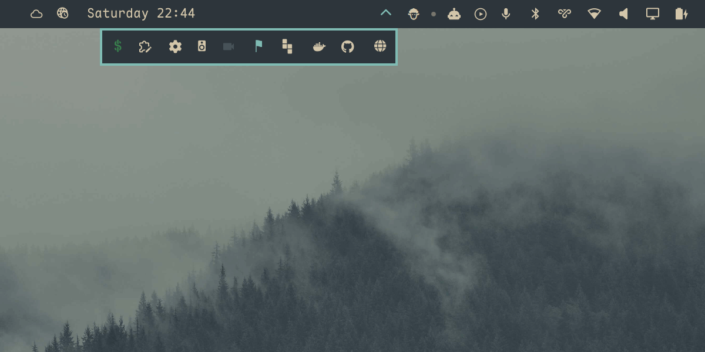

# Nook

A bar drawer for Omarchy, for when too many plugins have cluttered your bar.
Collapse the ones you rarely touch into a tray that opens below the bar rather
than along it, so nothing on the bar gets covered or moved. Drag widgets in and
out.



## Install

```sh
omarchy plugin add https://github.com/Katsari/nook.git --enable
```

## Usage

Hover the chevron to open the tray. Click it to pin the tray open, and click
again to put it away. Click a widget inside to use it as you would on the bar.

Drag a widget off the bar onto the chevron to file it away, drag one inside the
tray to reorder it, and drag one out to put it back on the bar. A caret marks
where it will land. A press too short to become a drag stays a click.

Every move rewrites `~/.config/omarchy/shell.json`.

## Settings

Settings live on Nook's `bar.layout` entry in `~/.config/omarchy/shell.json`.

| Key        | Default   | Meaning                                                         |
| ---------- | --------- | --------------------------------------------------------------- |
| `items`    | `[]`      | The widgets inside, as layout entries                           |
| `trigger`  | `"hover"` | `"hover"` opens on pointer-over; anything else means click-only |
| `duration` | `180`     | Reveal animation, in milliseconds                               |

The tray's layer surface is named `nook`, for Hyprland layer rules.

Custom modules work too. An entry with `exec` runs its command on an interval
and shows the output, the same as on the bar; one with `source` loads that QML
file. Neither is a plugin, so neither needs a `plugins[]` entry.

Each item takes the same shape as a bar layout entry, so per-widget settings go
on the item:

```json
{
  "id": "io.github.katsari.nook",
  "trigger": "hover",
  "items": [
    { "id": "some.widget" },
    { "id": "another.widget", "format": "short" }
  ]
}
```

Editing `items` by hand needs a second step: add each widget to the top-level
`plugins[]` array as well, or it stays disabled and never renders. Dragging
does both for you.

## Commands

```bash
omarchy-shell io.github.katsari.nook toggle            # also: open, close
omarchy-shell io.github.katsari.nook absorb <id>       # move a widget in
omarchy-shell io.github.katsari.nook eject <id>        # put one back on the bar
omarchy-shell io.github.katsari.nook reorder <from> <to>
omarchy-shell io.github.katsari.nook status            # what it thinks it is doing
```

`reorder` takes positions among the widgets the tray draws, counting from
zero. `to` is an insertion index measured before the move, so `reorder 0 3`
puts the first widget third.

Read `status` when a gesture misbehaves: it separates a wrong state from a
pointer that never arrived.

## Tests

```sh
tests/all.sh
```

GitHub Actions runs the node tests and the source checks on every push. The
lint and harness legs need the omarchy shell source and a Wayland session, so
they skip themselves there and only run locally.

`tests/layoutmodel.test.js` runs every shell.json edit in `LayoutModel.js`
under node. `tests/qml.test.sh` lints `BarWidget.qml`, checks that the QML and
the library agree, and loads the real widget in a throwaway quickshell
instance against a mock bar to drive absorb, reorder, eject, and both
reconcile paths end to end.

`tests/drag.test.py` drives the real pointer, so it is opt-in:

```sh
tests/all.sh --drag
```

It drags a widget off the bar into the drawer, hovers the chevron and checks
the widget is actually drawn below the bar, then drags it back out. It takes
over the mouse for about twenty seconds. Build the pointer once with
`tests/tools/vptr/build.sh`. `shell.json` is snapshotted first and restored at
the end, pass or fail.

## Troubleshooting

Changing Nook's code needs a shell restart, not a rescan. The shell logs
"Local plugin changed, reloading", but a plugin whose entry-point URL is
unchanged keeps its already-compiled component: neither the local-plugin
watcher nor `omarchy-shell shell rescanPlugins` swaps in the new one. The
old Nook therefore stays loaded, which on Omarchy 4.0.3 shows up as a `?` on
every hosted widget. After `omarchy plugin update io.github.katsari.nook`, or
after editing the drawer by hand, run:

```sh
omarchy restart shell
```

## Remove

```sh
omarchy plugin remove io.github.katsari.nook
```

Whatever the tray held stays in `items` on that entry, so removing Nook while
it is full leaves those widgets off your bar. Drag them out first, or `eject`
each one.

## Known limits

Built for Omarchy 4.0.3. Beyond the widget contract every plugin uses, Nook
reaches into the bar's widget registry, its slot and click-target
bookkeeping, and its drag state. No plugin API covers those. 4.0.3 stopped
handing third-party widgets the real bar, so Nook now adopts it from a
first-party widget on the same bar; on a bar without any first-party widget
it sits inert. A future update can break it again.

- **One Nook per bar.** The manifest sets `allowMultiple` false, so the bar
  will not add a second. A hand-written one would still load, and both would
  write to the first entry they find.
- **Bottom and right bars can misroute a bar click.** `Bar.moduleClickTargetAt`
  maps a click into every registered target's geometry without checking which
  window the target is in, and on those two edges the tray overlaps the bar's
  coordinate range. The chevron is covered; other bar widgets are not.
- **The bar's own tooling does not see inside the tray.** `omarchy bar set`,
  `omarchy bar move` and `omarchy-shell shell listPlugins` all read
  `bar.layout`, so a hosted widget reads as absent, and `listPlugins` reports
  it disabled. Eject it to configure it from the command line.
- **Panel numbers skip hosted widgets.** `omarchy-shell shell togglePanelAt`
  counts the panels visible in a bar section, so the tray's contents are not
  in the count. Toggling a panel by id works: `omarchy-shell shell summon
<id>` opens the tray and its panel with it.
